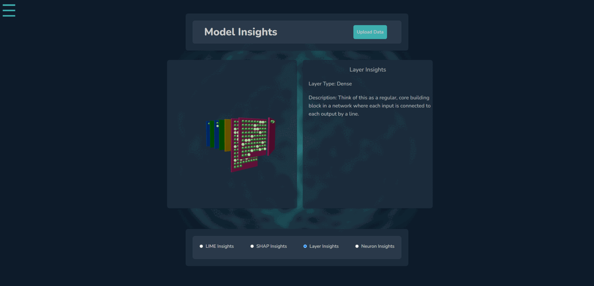

# ModelSense

A web application built with React and Django for uploading and visualizing user neural network models and data.

## Introduction

ModelSense is a powerful tool that allows users to upload their machine learning models and data for interactive visualization. It's built with React and Django, providing a user-friendly experience.

## Current Features

- **Model Upload:** Easily upload your machine learning models (supports .h5)
- **Data Visualization:** Visualize your data and models intuitively and interactively
- **Layer Insights:** Hover over 3d model and insights about the layer type will be shown to the right

## Requirements

- [Node. js](https://nodejs.org/)
- [npm](https://www.npmjs.com/)
- [Python](https://www.python.org/)
- [Django](https://www.djangoproject.com/)
- [React](https://reactjs.org/)
- [Three.js](https://threejs.org/)
- [Three.js / Drei](https://github.com/pmndrs/drei)
- [Three.js / Fiber](https://docs.pmnd.rs/react-three-fiber)

## Current Support

- **Neuron Max:** No more than 207 neurons per layer

## Work in Progress

- **Model Storage** Implement a database to store the user's uploads
- **Data Upload:** Upload datasets for even more custom visualization alongside your models.
- **Finish Analytics** Implement Shapely, Lime, and Neuron Insights  
